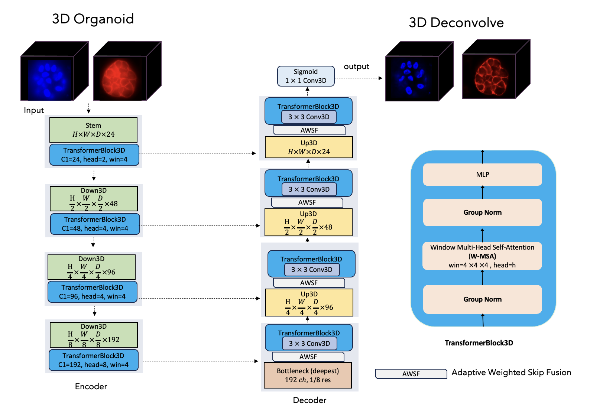

# **Deconv3D: Transformer-Based 3D Deconvolution for Microscopy Volumes**

mDeconv3D is a lightweight 3D deconvolution model that restores blurred and noisy microscopy volumes by combining local feature extraction from 3D convolutions with global context modeling from windowed 3D self-attention. A Conv–Transformer encoder captures multiscale representations, while a skip-connected decoder refines and upsamples them to produce a clean, high-fidelity volume.




------------------------------------------------------------------------

## 📁 **Repository Structure**

    Deconv3D/
    │── deconv3d_train_infer.py      # Main training & inference script
    │── rl_deconv3d/
    │     └── rl_deconv3d.py         # Classical RL 3D deconvolution baseline
    │── care3d/
    │     └── care3d.py              # CARE‑3D baseline (CSBDeep)
    │── utils/
    │     ├── metrics.py             # PSNR, SSIM, EdgeSSIM, NCC
    │     ├── io_utils.py            # Loading, normalization, saving volumes
    │     └── sliding_window.py      # Patch‑based inference
    │── data/
    │     └── pairs.csv              # Raw ↔ GT volume mapping
    │── runs/
    │     └── model_outputs/         # Training logs, checkpoints, results
    │── results/
    │     ├── metrics.csv            # Evaluation metrics
    │     └── figures/               # Model visualizations
    │── README.md

------------------------------------------------------------------------

## 📦 **Installation**

``` bash
git clone https://github.com/sohaibcs1/deconv3d.git
cd Deconv3D

conda create -n deconv3d python=3.10 -y
conda activate deconv3d

pip install -r requirements.txt
```

------------------------------------------------------------------------

## **Dataset Format**

The dataset is defined using a simple CSV file:

    raw,gt
    dataset/train/raw_01.nii.gz, dataset/train/gt_01.nii.gz
    dataset/train/raw_02.nii.gz, dataset/train/gt_02.nii.gz
    ...

------------------------------------------------------------------------

## **Training Deconv3D**

``` bash
python deconv3d_train_infer.py train \
  --pairs data/pairs.csv \
  --out_dir runs/safe_run_24ch_p64 \
  --epochs 30 --batch 2 --patch 64 --ppv 48 \
  --base_ch 24 --win 4 --lr 5e-5 \
  --ssim_alpha 1 --early_stop 6 \
  --no_amp --plot_curves

```

### Important Arguments

  Argument       Meaning
  -------------- -------------------------------------------------------
  `patch`        Training patch size (D=H=W)
  `ppv`          Patches-per-volume (sampling density)
  `base_ch`      First feature channel count (expands 32→64→128...)
  `win`          Attention window size
  `ssim_alpha`   Weight between L1 and SSIM
  `early_stop`   Stop training if validation does not improve N epochs

------------------------------------------------------------------------

## 🔍 **Inference (Predict Full 3D Volume)**


``` bash
python deconv3d_train_infer.py infer \
  --weights runs/safe_run_24ch_p64_sec/best_3d_deconv.pt \
  --in_nii  /home/msohaib/reconstruct_3d/jusuff_test/high/s/MCF7_19_no_apotome_raw_s.nii.gz \
  --gt_nii  /home/msohaib/reconstruct_3d/jusuff_test/high/s/MCF7_19_no_apotome_processed_s.nii.gz \
  --out_dir preds_final_low \
  --roi 64 --overlap 0.5 --base_ch 24 --win 4 --pad_win \
  --metrics_csv preds_final_water/metrics_mcf7.csv

```

Outputs: - Restored 3D volume
- Evaluation metrics (PSNR, SSIM, EdgeSSIM...)
- CSV file with metrics


``` bash
CUDA_VISIBLE_DEVICES=4 python deconv3d_train_infer.py infer \
  --weights runs/safe_run_alpha1/best_3d_deconv.pt \
  --in_nii  /home/msohaib/reconstruct_3d/jusuff_test/low_evos/new/mcf10a_F.nii.gz \
  --out_dir /home/msohaib/reconstruct_3d/jusuff_test/low_evos/preds \
  --roi 64 --overlap 0.5 --base_ch 24 --win 4 --pad_win --no_amp

```

Outputs: - Restored 3D volume

------------------------------------------------------------------------

------------------------------------------------------------------------
##  **Example**


## **Citation**

If you use Deconv3D, please cite:

    @article{Deconv3D2025,
      title={Deconv3D: A Transformer-Based Framework for 3D Microscopy Image Deconvolution},
      author={Muhammad Sohaib et al.},
      year={2026}
    }

------------------------------------------------------------------------

## **Contact**

For questions or collaborations:

**Muhammad Sohaib**\
University of Nevada, Reno\
📩 msohaib.bio@gmail.com\
🌐 https://github.com/sohaibcs1/
