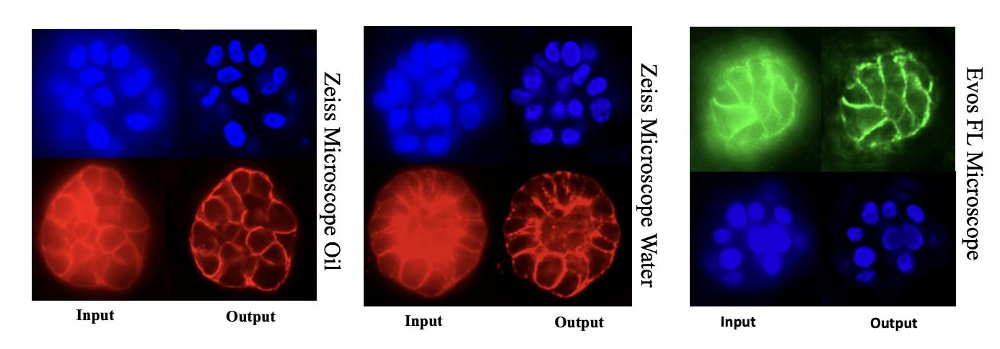

# **Deconv3D: Transformer-Based 3D Deconvolution for Microscopy Volumes**

mDeconv3D is a lightweight 3D deconvolution model that restores blurred and noisy microscopy volumes by combining local feature extraction from 3D convolutions with global context modeling from windowed 3D self-attention. A Conv–Transformer encoder captures multiscale representations, while a skip-connected decoder refines and upsamples them to produce a clean, high-fidelity volume.


------------------------------------------------------------------------

## 📁 **Repository Structure**
```
deconv3d/
├── README.md
├── requirements.txt
├── assets/
│   ├── example.png
│   └── model.png
├── model/
│   ├── main.py          # training & inference CLI (train / infer)
│   └── model.py         
├── checkpoints/
│   ├── 3d_deconv.pt
│   ├── dapi/
│   │   └── best_3d_deconv.pt
│   ├── polarity/
│   │   └── best_3d_deconv.pt
│   └── dapi_polarity/
│       └── best_3d_deconv.pt
├── data/
│   ├── pairs_example.csv
│   └── ...
├── examples/
│   ├── metrics_AT1_no_apotome_07_raw_predict.csv
│   └── metrics_AT1_no_apotome_07_raw_s_predict.csv
└── notebooks/
    ├── npari_randring.ipynb
    └── vis_nii_color.ipynb
```

------------------------------------------------------------------------

## 📦 **Installation**

``` bash
git clone https://github.com/sohaibcs1/deconv3d.git
cd Deconv3D

conda create -n deconv3d python=3.10 -y
conda activate deconv3d

pip install -r requirements.txt
```

------------------------------------------------------------------------

## **Dataset Format**

The dataset is defined using a simple CSV file:

    raw,gt
    dataset/train/raw_01.nii.gz, dataset/train/gt_01.nii.gz
    dataset/train/raw_02.nii.gz, dataset/train/gt_02.nii.gz
    ...

------------------------------------------------------------------------

## **Training Deconv3D**

``` bash
python deconv3d_train_infer.py train \
  --pairs data/pairs.csv \
  --out_dir runs/safe_run_24ch_p64 \
  --epochs 30 --batch 2 --patch 64 --ppv 48 \
  --base_ch 24 --win 4 --lr 5e-5 \
  --ssim_alpha 1 --early_stop 6 \
  --no_amp --plot_curves

```

### Important Arguments

  Argument       Meaning
  -------------- -------------------------------------------------------
  `patch`        Training patch size (D=H=W)
  `ppv`          Patches-per-volume (sampling density)
  `base_ch`      First feature channel count (expands 32→64→128...)
  `win`          Attention window size
  `ssim_alpha`   Weight between L1 and SSIM
  `early_stop`   Stop training if validation does not improve N epochs

------------------------------------------------------------------------

## 🔍 **Inference (Predict Full 3D Volume)**


``` bash
python deconv3d_train_infer.py infer \
  --weights runs/.../best_3d_deconv.pt \
  --in_nii  /home/msohaib/.../MCF7_raw.nii.gz \
  --gt_nii  /home/msohaib/.../MCF7_processed.nii.gz \
  --out_dir preds_final_low \
  --roi 64 --overlap 0.5 --base_ch 24 --win 4 --pad_win \
  --metrics_csv preds_final_water/metrics_mcf7.csv

```

Outputs: - Restored 3D volume
- Evaluation metrics (PSNR, SSIM, EdgeSSIM...)
- CSV file with metrics


``` bash
python deconv3d_train_infer.py infer \
  --weights runs/.../best_3d_deconv.pt \
  --in_nii  /home/msohaib/.../mcf10a.nii.gz \
  --out_dir /home/msohaib/.../preds \
  --roi 64 --overlap 0.5 --base_ch 24 --win 4 --pad_win --no_amp

```

Outputs: - Restored 3D volume

------------------------------------------------------------------------

------------------------------------------------------------------------
##  **Example**

The figure compares Deconv3D performance across microscopy systems with varying optical quality. Zeiss Oil (left) represents high-resolution imaging, while Zeiss Water and Evos FL90 (middle and right) are lower-resolution modalities. In all cases, Deconv3D restores fine structural details, enhances contrast, and reduces blur—demonstrating strong robustness and generalization across high and low-resolution microscopy setups.




## **Citation**

If you use Deconv3D, please cite:

    @article{Deconv3D2025,
      title={Deconv3D: A Transformer-Based Framework for 3D Microscopy Image Deconvolution},
      author={Muhammad Sohaib et al.},
      year={2026}
    }

------------------------------------------------------------------------

## **Contact**

For questions or collaborations:

**Muhammad Sohaib**\
University of Nevada, Reno\
📩 msohaib.bio@gmail.com\
🌐 https://github.com/sohaibcs1/
